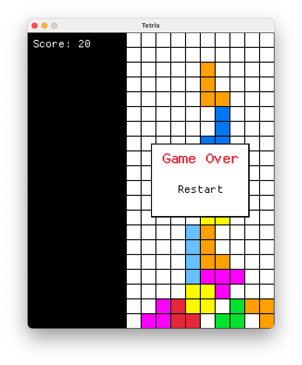

# A Vibe Coding Rust Tetris

This is a classic Tetris game built from scratch in Rust using the `macroquad` game engine. It was developed as a fun, "vibe coding" project to explore game development in Rust.



*Note: Please add a `Tetris.png` screenshot to the root of the project for the image to display.*

## Features

*   **Classic Tetris Gameplay:** Move, rotate, and drop tetrominoes to clear lines and score points.
*   **Super Rotation System (SRS):** A fully compliant wall kick and rotation system for fluid, modern piece movement.
*   **Ghost Piece:** A transparent projection shows exactly where the current piece will land.
*   **Soft & Hard Drops:** Speed up the descent with the **down arrow** or instantly drop the piece with the **spacebar**.
*   **Scoring System:** Keep track of your score as you clear lines.
*   **Pause & Restart:** Pause the game at any time with **Escape** or the pause button. Restart from the pause menu or the game over screen.
*   **Custom UI:** A clean interface with a dedicated score panel and intuitive pop-up menus.

## Installation & Running

This project requires the **nightly** Rust toolchain to run.

1.  **Clone the repository:**
    ```sh
    git clone https://github.com/your-username/TetrisRust.git
    cd TetrisRust
    ```
    *(Please replace the URL with your actual repository URL.)*

2.  **Install the nightly toolchain:**
    If you don't have the nightly toolchain installed, run the following command:
    ```sh
    rustup toolchain install nightly
    ```

3.  **Set the nightly toolchain for this project:**
    You can set nightly as the default for this specific project by running:
    ```sh
    rustup override set nightly
    ```
    Alternatively, you can set it as your global default:
    ```sh
    rustup default nightly
    ```

4.  **Run the game:**
    ```sh
    cargo run
    ```
